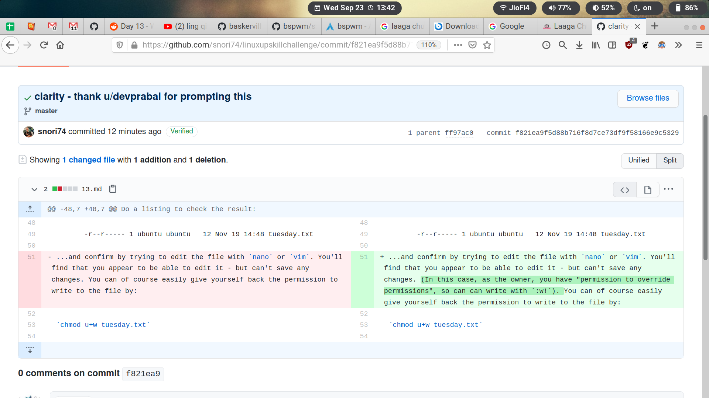

# Day 13

## Notes

- It seems that we can overwrite the contents of the file whose permission is `000` (no read, write, execute perm for user, group, or others) with `sudo` command and can the delete the file without `sudo` (because we are the user who owns that file).
- `chmod` can be done without `sudo` if the file is owned by you.
- `chmod` ugo-x, g+x, o-r` and so on are sometimes more simpler to use than the octal numbers like `666`, `776`, `770` etc.

- [x] `adduser` is more friendly than `useradd` as it asks for the password for the new user, it creates new user's home dir and copies some basic files (from `/etc/skel` like `.bashrc`) into the new user's home dir. All of these is done without any option to `adduser`. However, if `useradd` is not given any option, then it will just create the new user and the group related to that user and add that user to that newly created group. It will not create home dir, not ask for password, and not copy files from `/etc/skel`.
- [x] By default, the new user (who is not the first user of the system) will not be added to the `sudo` group. This can be verified by `sudo su newuser` followed by `groups`. That is, changing to the new user and then listing their groups. As such, when the newuser tries to do `sudo` then such incident will be reported, and an entry will be placed under `/var/log/auth.log` as every instance of sudo (whether or not the user has permission for it) is recorder in that file.
We can see one such result by `grep -a "NOT" /var/log/auth.log | grep sudo | grep fred` where **fred** is the new user.

```txt
Sep 23 12:49:05 Ariana sudo:     fred : user NOT in sudoers ; TTY=pts/0 ; PWD=/home/fred ; USER=root ; COMMAND=/usr/bin/less /var/log/auth.log
```

- [x] We will have to add fred to **sudo** group using our main user account **haiji** like this - `sudo usermod -a -G sudo fred`.

- [x] Then we can switch to user **fred** again (`sudo su fred`)(This will ask for **haiji**'s password, ofcourse) and then see the list of groups for which **fred** is a member by `groups`.

- [x] Notice also that **fred** cannot read `/var/log/auth.log` unless they are added to the group **adm** or prefix it with `sudo`. **haiji** can read it without prefixing `sudo`.

## Info

A new user **fred** has been added to *Ariana*  and they are a member of groups **fred** and **sudo** (not **adm**).

## Questions and Answers

[reddit link](https://www.reddit.com/r/linuxupskillchallenge/comments/ixwvq4/thoughts_and_comments_day_13/g6ap7b6?utm_source=share&utm_medium=web2x&context=3)

I don't see a difference if the perm is -r--r----- or -rw-r----- I can always overwrite the file with :w! in vim. Since I can read the file as well therefore the previous content doesn't get lost. This is in contrast to permission 000 where the previous content would get lost if we try to write a file forcefully with :w! in vim (because we could not read the contents too).

Please tell me where I am wrong in this interpretation?

> Yes, but this is a special feature of vim - and even in that case a simple _:w_ will fail with an error message (prompting you that you can use "!") - AND this only works because as owner of the file, you have "the permission to override permissions" in this case.
> Thanks for the question - I've updated the notes based on this feedback)

## Inspiration


[github link](https://github.com/snori74/linuxupskillchallenge/commit/f821ea9f5d88b716f8d7ce73df9f58166e9c5329)

## Readings

- [ ] `umask`
- [ ] [How to manage ACLs on Linux](https://linuxconfig.org/how-to-manage-acls-on-linux)
- [ ] [Linux Access Control Lists](https://www.redhat.com/sysadmin/linux-access-control-lists)
- [ ] [Security-Enhanced Linux (at the NSA!)](https://www.nsa.gov/what-we-do/research/selinux/)
- [ ] [SELinux For Mere Mortals](https://craigmbooth.com/blog/selinux-for-mortals/)
- [ ] [Securing Ubuntu 18 04 with Apparmor](https://www.youtube.com/watch?v=lJFxexGZ-DY)
- [ ] [File Security](http://tldp.org/LDP/intro-linux/html/sect_03_04.html)
- [ ] [chmod Tutorial](http://catcode.com/teachmod/)
- [ ] [File and Directory Permissions](http://www.youtube.com/watch?v=vKTg1ATHl4E)

