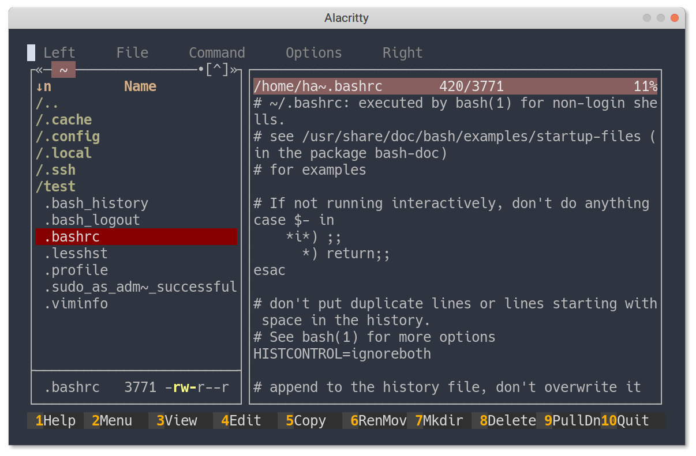

# Day 4

## Notes

- [x] `apt search`ed and installed midnight commander. Contrary to my previous experience with `mc`, this time I am finding it better after I removed the excess information that it shows by default. So, I customized it a bit, configs [here](assets/mc-ini-Ariana) and [here](assets/mc-panels.ini-Ariana).

- [x] used `scp` to transfer the above config files. A quick man page glance got me the command I needed.

- [x] looked `man hier` for directory structure.
- [x] looked around files like `/var/log/auth.log`, `/var/log/apt/history.log`, `/etc/passwd`, `/etc/ssh/sshd_config`, `/etc/apt/sources.list` 
- [ ] install `hangman` game.

## Readings

- [ ] [Repositories - CommandLine
](https://help.ubuntu.com/community/Repositories/CommandLine)
- [ ] [Ubuntu and Red Hat/CentOS package management comparison]( https://help.ubuntu.com/community/SwitchingToUbuntu/FromLinux/RedHatEnterpriseLinuxAndFedora)
- [ ] [Ubuntu Server Guide - Package Management](https://ubuntu.com/server/docs/package-management)
- [ ] [Midnight Commander vs Ranger](https://www.slant.co/versus/6822/7576/~midnight-commander_vs_ranger)
- [ ] [Linux directory system explained](https://www.howtogeek.com/117435/htg-explains-the-linux-directory-structure-explained/)
